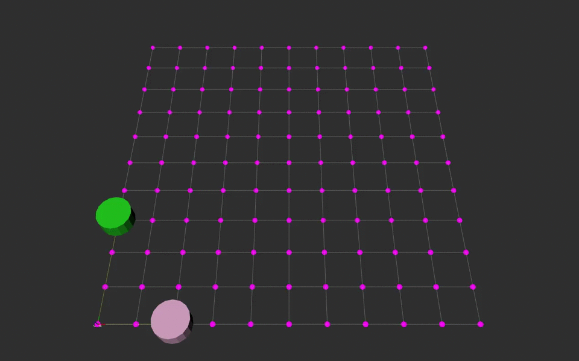
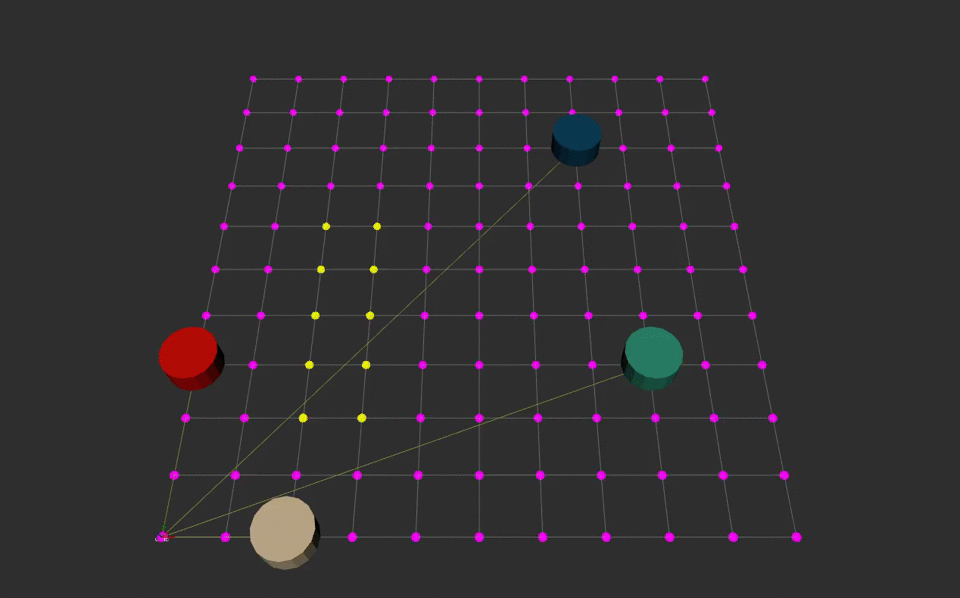

# Multi-agent Path Planner
Created by Solomon Wiznitzer as a solution for a coding challenge.
## Description
**Objective:** To perform motion planning for at least 2 robots (where each robot can only move along the edges between nodes) and display the planned paths in Rviz.

**How It Works:** There were four parts to this project.
- *Creating a Roadmap* - This part included configuring Rviz to display a 10x10 grid with (0,0) being at the bottom left corner and (10,10) being at the top right corner. It also entailed drawing a marker representation of all the nodes.
- *Coding the Planner node* - As its name suggests, this involved implementing an algorithm to determine the minimum distance path from a robot's initial starting position to a user-specified goal position. Additionally, the node was responsible for archiving the planned paths so that they could potentially be reused for future robots.
- *Coding the Agent node* - The third part required building a node that would take in a user-specified goal position via a ROS service, request the planned path from the Planner node, and then publish the robot and path markers in Rviz.
- *Testing the system* - In this last part, a launch file was used to start up two robots at specific starting positions. A ROS service hosted by the Agent node was then used (via the Linux Terminal) to update the goal positions to certain values and watch as the paths were displayed on Rviz.

**System Info:** This package was tested on Ubuntu Linux 16.04 with ROS Kinetic.

### Runtime Instructions
After cloning the repo and building it, just type `roslaunch multi_agent_planner agents.launch` into the terminal to get started. This will launch Rviz and show a 10x10 grid of purple nodes with two colored cylinders (the robots). The colors are randomly generated so if they are too similar in appearance, just `Cntrl-C` and launch the nodes again. By default, *agent_1* (the first robot) is located at position [2,0,0] and *agent_2* (the second robot) is at [0,3,0] (the order is x[m], y[m], yaw[deg]). At startup, you should see three helpful messages printed out to the console confirming that services are running. They are...
```
Motion planner service (/get_plan) is ready.
Ready to update goal pose for agent_1
Ready to update goal pose for agent_2
```
To update the pose for a robot, open up another command terminal and type...
```
rosservice call /agent_x/update_goal
```
and hit tab a couple times ('x' is a placeholder for '1', '2', '3', etc... based on which agent you would like to set the goal pose for). A 'zeroed out' `geometry_msgs::Pose2D` ROS message should appear. Fill it in with whatever pose you so choose as long as the 'x' and 'y' values are integers, and press Enter. If an archived path cannot be found in the Planner node, a message will appear in the terminal saying...
```
Using A* algorithm for agent_x as complete archived path could not be found
Algorithm found a path for agent_x
```
This just means that the A\* algorithm implemented in the Planner node was successful in finding a minimum distance path. Although A\* is overkill for this particular challenge as there are no obstacles and the cost to go from one node to another is uniform, I still implemented it just for fun. Anyway, at this point, the cylinder representing the agent will begin to move as shown below.



The above GIF shows the two robots move after making two consecutive calls to the `update_goal` rosservice. The red cylinder represents `agent_1` as it goes from its initial pose of [2,0,0] to [2,5,0]. The teal cylinder represents `agent_2` as it goes from its intitial pose of [0,3,0] to [6,3,0]. No matter the initial and goal positions, it will always take 10 seconds for the robots to traverse the distance as specified in the challenge. Unfortunately, the GIF does not show this accurately. However, the AVI video clips in the media directory do! So feel free to take a look and time them. In any event, once each robot arrives at its goal pose, a message is printed out to the terminal saying...
```
Target goal has been reached by agent_x
```
If the user would then enter any point along, let's say, `agent_1`'s path as a goal_pose for `agent_1`, a message will appear in the terminal displaying...
```
Using an archived path originally created for agent_x
```
where in this case, `agent_x` represents the robot that had traversed that path originally. This essentially means that the Planner node was able to 'crop' so-to-speak an archived path to the 'start' and 'goal' points that was requested from the service. This saves the node from having to recompute the A\* algorithm. Besides for these messages, there are a few others that will get printed to the user if an invalid goal pose is entered or the user just wants a robot to rotate in place (which it can do! Just it's hard to see with cylindrical robots). However, I will not describe them here.

 ### Extra Features
 As already mentioned, this challenge could have been implemented using a simpler algorithm as the map has no obstacles and the edge costs are all the same. For example, the difference between the 'x' and 'y' coordinates of the goal and start poses respectively could be used to figure out (based on if the difference was positive or negative) what node the agent should travel to next. That said, the following is a list of additional features.
 - Implementing the A\* algorithm to find the minimum distance
 - Animating the motion of the robots from the start to goal poses, including rotation
 - Not just reusing an archived path if the start and goal poses exactly match but also if the requested path can be found within the archived path
 - The system is scalable; there is no reason more agents cannot be inserted. All that would need to be done is to add another `agent_node` to the launch file and another Marker display in Rviz.
 - The system can work with obstacles in the grid as well.
 - Both nodes were implemented as objects in code. As a result, it is a simple matter of changing one parameter in the constructor to make the grid larger or smaller, change the `edge_cost` value, or change the speed it takes for a robot to traverse the path.

 Below is a GIF of four robots moving in the grid. The yellow nodes represent obstacles in the world. A video of this can be found in the `media` directory.
 
